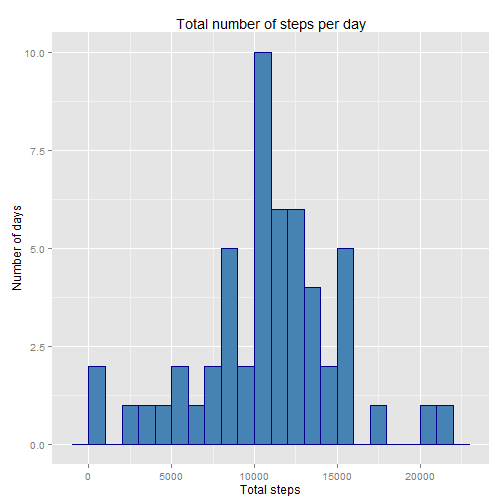
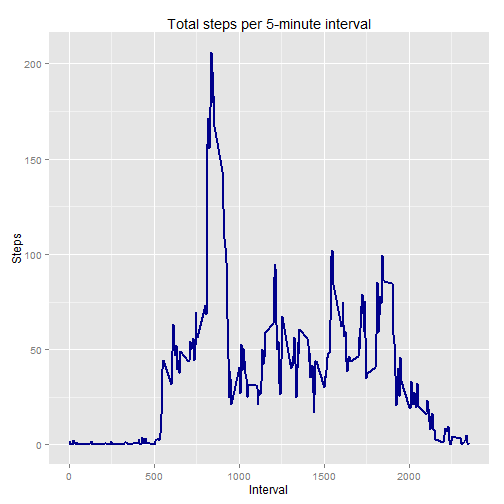
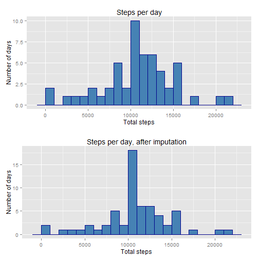
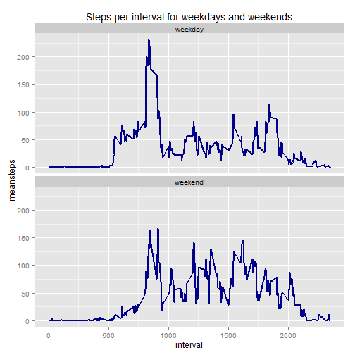

#  Report for project 1 in the reproducible research course

## Introduction
The full description of the assignement can be found in the [README](https://github.com/ninnakin/RR_Project_1/blob/master/README.md)

In short, the task is to explore the patterns in a dataset containing the number of steps taken over two months by one individual. The steps are counted in 5-minute intervals for each day. 

## Loading and preprocessing the data
Load the data from the file activity assuming this file is placed in the folder activity in your work directory. Start by loading any packages needed. Then read the data to the variable *activity*.

```r
library(dplyr)
library(ggplot2)
activity <-  read.csv("activity/activity.csv", header=TRUE, na.strings = "NA", stringsAsFactors = FALSE)
```

When the data is loaded transform the character column *date* to date format

```r
activity$date <- as.Date(activity$date,"%Y-%m-%d")
```
## What is the mean total number of steps taken per day?
To answer this question I will explore the total number of steps per day. 
I will start by calculating the total number of steps for each day in the dataset and store this in steps.per.day. I will then plot a histogram over the steps per day. Finally, we will look at the median and mean of the total number of steps per day.  

The total number of steps per day can be computed like this: 

```r
steps.per.day <-  activity %>% na.omit() %>% group_by(date) %>% summarise(totsteps = sum(steps))
```

And the corresponding histogram looks like this:


```r
ggplot(data=steps.per.day, aes(totsteps))+geom_histogram(binwidth=1000, fill="steelblue", col="darkblue")+ggtitle("Total number of steps per day")+xlab("Total steps")+ylab("Number of days")
```

 

Both the mean and median number of total steps per day can be obtained by the summary function. 


```r
summary(steps.per.day$totsteps)[c("Mean","Median")]
```

```
##   Mean Median 
##  10770  10760
```

## What is the average daily activity pattern?
I will explore the daily activity pattern by plotting the average number of steps for each five minute period summed over the days in the experiment. We will investigate which five minute interval is the most active, i.e. has the largest average number of steps.

I start by computing the total steps per interval and save this to the variable *steps.per.interval*

```r
steps.per.interval <-  activity %>% na.omit() %>% group_by(interval) %>% summarise(meansteps = mean(steps))
```

I then plot this as a function of the interval. From this plot it appears that the most active period is between interval 750 and 1000.

```r
ggplot(data=steps.per.interval, aes(x=interval, y=meansteps))+geom_line(size=1, col="darkblue")+ggtitle("Total steps per 5-minute interval")+xlab("Interval")+ylab("Steps")
```

 

Identify the interval with the largest number of steps:

```r
steps.per.interval[steps.per.interval$meansteps==max(steps.per.interval$meansteps),]
```

```
## Source: local data frame [1 x 2]
## 
##   interval meansteps
##      (int)     (dbl)
## 1      835  206.1698
```
So the interval is interval number 835 and the largest mean number of steps for an interval is 206

## Imputing missing values
Some days and intervals don't have any recorded values for the steps. I will first investigate how common this is, and then impute values where missing to avoid data bias.

### Investigating the missing values
How many values are missing, and what are their patterns?

```r
sum(is.na(activity$steps))
```

```
## [1] 2304
```

```r
mean(is.na(activity$steps))
```

```
## [1] 0.1311475
```

```r
# more patterns for missing data
missing <- activity[is.na(activity$steps),]
# How many days have missing data? 
unique(missing$date)
```

```
## [1] "2012-10-01" "2012-10-08" "2012-11-01" "2012-11-04" "2012-11-09"
## [6] "2012-11-10" "2012-11-14" "2012-11-30"
```

```r
# how many intervals are missing for these days?
missing %>% group_by(interval) %>% count(date)
```

```
## Source: local data frame [8 x 2]
## 
##         date     n
##       (date) (int)
## 1 2012-10-01   288
## 2 2012-10-08   288
## 3 2012-11-01   288
## 4 2012-11-04   288
## 5 2012-11-09   288
## 6 2012-11-10   288
## 7 2012-11-14   288
## 8 2012-11-30   288
```
2304 values are missing, this corresponds to 13% of the rows in the dataset. Values are missing from 8 different dates that each miss data for 288 intervals. 

### Impute values when missing
The dates that miss data miss it for all intervals, so I can't use other data from the same date to impute information. Instead I will impute the mean number of steps for the missing interval. 

Create the new dataset *activity2* by imputing the mean for the missing intervals.


```r
tmp<-merge(missing, steps.per.interval, x.by=interval, y.by=interval)
activity2 <-merge(activity, tmp, by.x=c("interval", "date"), by.y=c("interval", "date"), all.x=TRUE, all.y=TRUE)
activity2$steps.x[is.na(activity2$steps.x)]=activity2$meansteps[is.na(activity2$steps.x)]
activity2 <-rename(activity2 , steps=steps.x)
activity2  <- select(activity2 , interval, date, steps)
```
### Create a histogram and mean/median counts for the dataset
Using this modified data, the mean and median number of steps per day is now: 

```r
steps.per.day2 <-  activity2  %>% group_by(date) %>% summarise(totsteps = sum(steps))
summary(steps.per.day2$totsteps)[c("Mean","Median")]
```

```
##   Mean Median 
##  10770  10770
```
The mean is unchanged, but the median changes slightly from 10760 to 10770

The histogram for the total steps before and after imputation looks like this: 

```r
library(gridExtra)

histdesign <- geom_histogram(binwidth=1000, fill="steelblue", col="darkblue")
xlabel <- xlab("Total steps")
ylabel <- ylab("Number of days")
p1 <- ggplot(data=steps.per.day, aes(totsteps))+ histdesign + xlabel + ylabel + ggtitle("Steps per day")
p2 <- ggplot(data=steps.per.day2, aes(totsteps))+ histdesign + xlabel + ylabel + ggtitle("Steps per day, after imputation")
grid.arrange(p1, p2, nrow=2)
```

 

Imputing the mean number of steps for the interval in place of the missing data have changed the data so that more days now have the most common number of steps, i.e. the largest bar in the histogram have grown even larger.  

## Are there differences in activity patterns between weekdays and weekends?
Add the factor variable *daytype* to the dataset to distinguish weekdays from weekends.

```r
activity2$daytype <- weekdays(activity2$date)
activity2$daytype[!activity2$daytype %in% c("lördag","söndag")] <- "weekday"
activity2$daytype[activity2$daytype %in% c("lördag","söndag")] <- "weekend"
activity2$daytype <- as.factor(activity2$daytype)
```

Plot the average number of steps for each interval for weekdays and weekends, respectively to see if there is any difference between which intervals have the most steps. 

```r
steps.per.daytype <-  activity2 %>% group_by(interval, daytype) %>% summarise(meansteps = mean(steps))
ggplot(steps.per.daytype, aes(interval,meansteps))+geom_line(size=1, col="darkblue")+facet_wrap(~daytype, nrow=2)+ggtitle("Steps per interval for weekdays and weekends")
```

 

Yes, it seems that activity is distributed differently between weekdays and weekends. 


